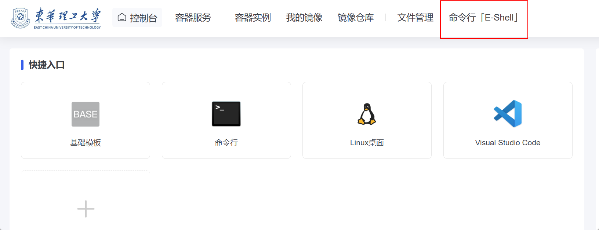
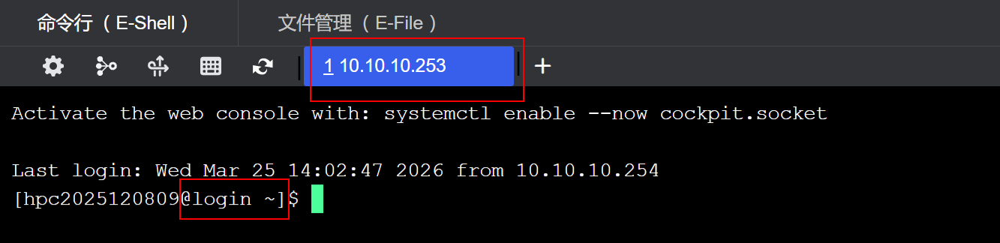
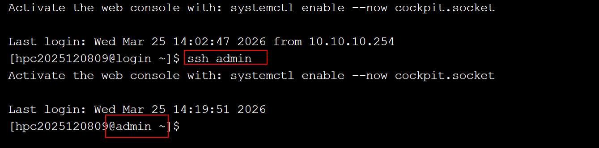
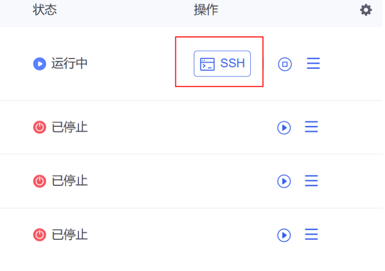
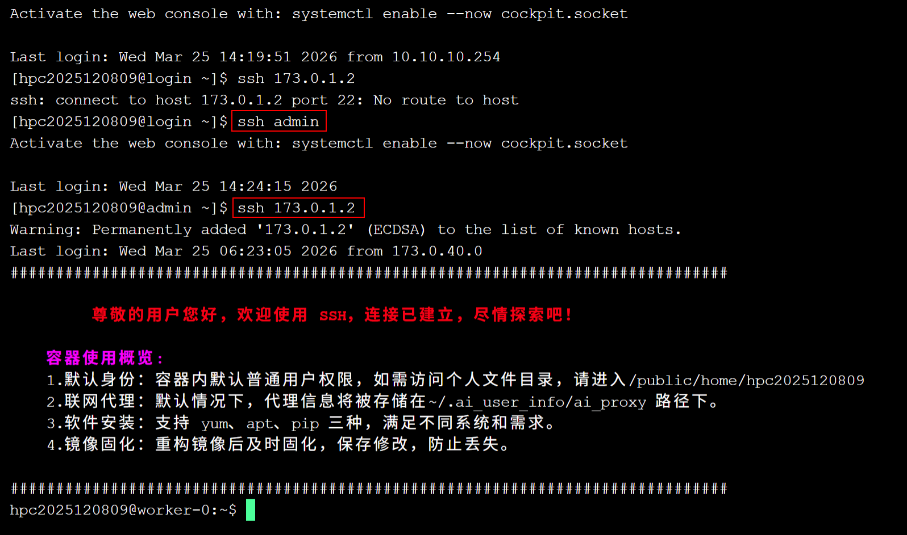
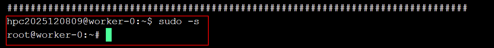

# 常见问题

本页汇总命令行、账号、节点切换和容器权限等常见问题。

## 命令行常见命令

原始石墨文档当前仅保留了该标题，尚未附详细命令清单。建议后续在 GitBook 中补充常用命令、适用场景与示例。

## 账号问题

### 第一种情况

进来的是登陆节点

这个时候，进来的是登陆节点，显示的ip是10.10.10.253

如果不使用容器实例，比如科学计算，用cpu那种，注意要切换到计算节点，命令是ssh admin。这样就到了计算节点。

### 第二种情况

如果是使用docker，要在容器实例里面执行，这里点ssh就到了容器实例里面。

注意此时的网址和账号

也可以使用命令 ssh 173.0.1.2

### 权限问题

进来之后，如果想安装python依赖，可能会权限不够，要将docker里面账号的权限提升到root，命令是sudo -s

