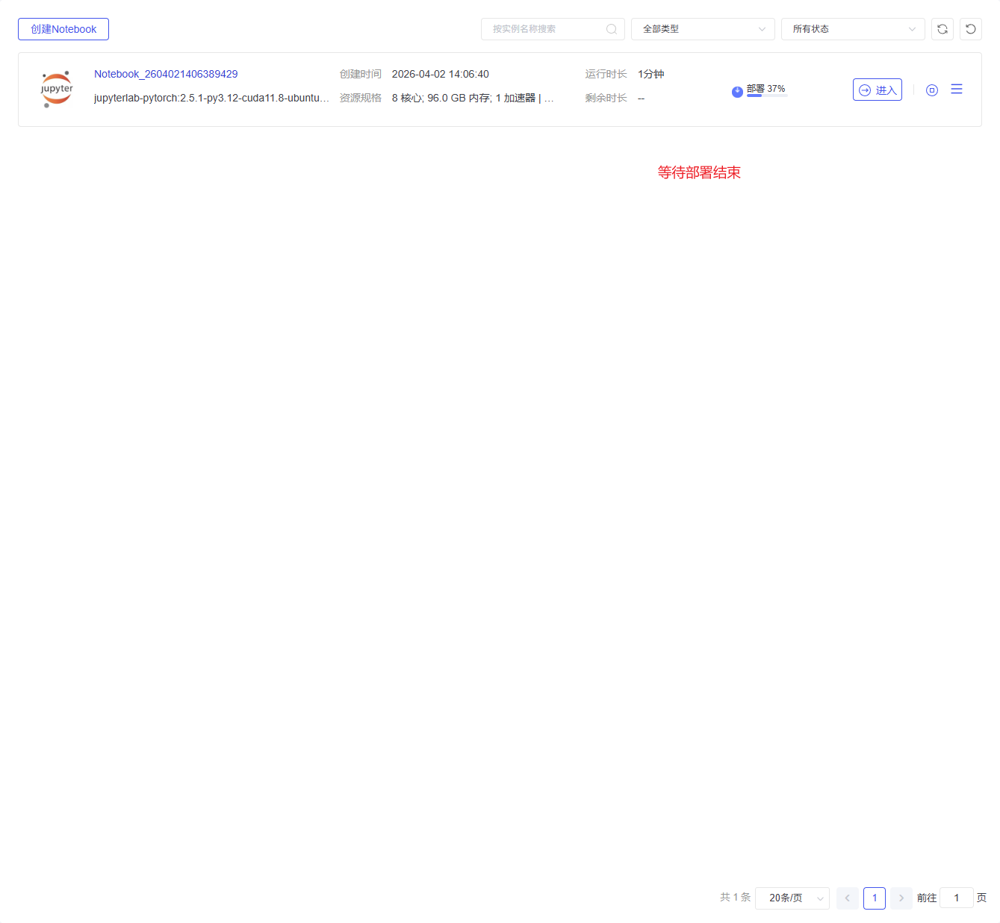
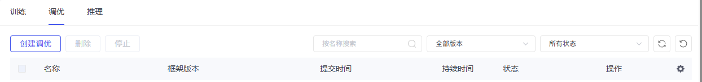
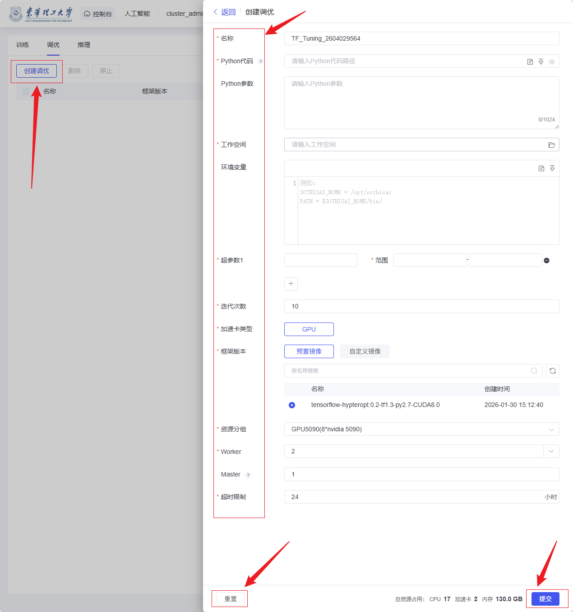
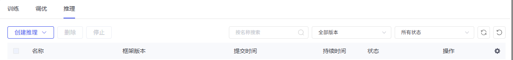
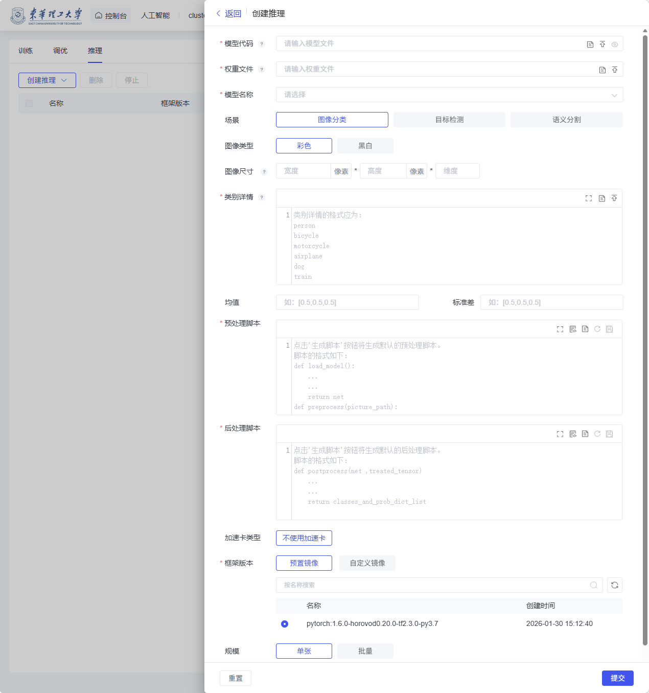

# 人工智能

本页整理 Notebook、数据管理、算法管理、模型训练和资产集市等 AI 相关能力。

## 人工智能

### Notebook

人工智能模块中的 【Notebook】功能主要用于为用户提供一个开箱即用的在线开发与实验环境，适合开展数据处理、模型训练、算法调试和结果分析等人工智能相关工作。
用户进入页面后，点击“创建 Notebook”，填写实例名称，并根据实际需求选择相应的框架版本（如 PyTorch、TensorFlow、DeepSpeed）和资源规格（如 CPU、内存、加速器等），也可通过“自定义创建”进一步配置运行环境；参数确认无误后，点击“创建”即可启动 Notebook 实例。
创建完成后，用户可直接进入在线交互式开发界面，在浏览器中编写和运行代码，无需单独安装本地环境。

Notebook 页面主要功能为创建 Notebook 任务，展示已创建的 Notebook 任务列表，包含列表的查询功能，列表主要展示 Notebook 信息包括：
实例名：表示创建的 Notebook 任务名称且不允许重复；
镜像版本：表示使用的镜像名称及版本；
创建时间：任务创建的时间；
规格：任务所占用的资源及持续时间
状态：表示当前任务的状态，有以下 5 种：“等待”表示任务已创建成功，正在等待计 算资源，“部署”表示正在部署实例所需的环境，“运行”表示任务正在运行，“停止”表示任务终止，“失败”表示任务执行失败；
操作：表示的是可进行的操作，可以进行 Notebook 任务启动，启动后可以对任务进行 停止，启动成功后可以进入 Notebook 界面，另外可以删除 Notebook 任务。

### 数据管理

#### 我的数据

在此界面，用户可以查看和管理已上传的数据集。点击“添加数据集”可上传新数据集，方便数据的后续使用和管理。

#### 我的订阅

该界面显示用户订阅的数据集，点击“订阅更多数据”可浏览和订阅其他数据集，扩展数据资源。

### 算法管理

算法管理功能，用于管理和共享用户的计算代码。用户可以通过“添加共享”按钮上传并共享自己的算法代码。
上传时，用户需填写代码名称、选择共享对象（如个人或团队）以及相关描述信息。完成后，点击“添加”按钮将算法共享给指定对象，其他团队成员可以通过此功能访问并使用共享的算法资源。
此功能有助于团队间的协作，提高计算资源的共享和利用效率。

### 模型训练

#### 训练

进入人工智能模块的模型训练功能，点击“模型训练”——>“创建训练”——>“Tensorflow/Pytorch”。

配置调参

相关选项说明：
“任务名”可以进行自定义，但不能重复；
“Python 代码”可以根据提示加载已有文件，或者上传本地文件；
“Python 参数”可以自定义输入对应参数；
“工作空间”可以通过自定义选择工作路径，一般填入 Python 参数会自动生成；
“TB 日志路径”也可自定义，可不填；
“环境变量”根据需要填写即可；
“任务类型”分为分布式和非分布式，根据需要选择即可；
“加速器类型”会根据实际的申请资源显示；
“框架版本”点击后面的箭头选择需要的即可；
“资源分组”为实际申请的 dcu 队列名；
“Parameter Server”可以调整 CPU 数量和内存大小，申请时默认 CPU 数     量2核，内存16G；
“Worker”可以调整 CPU 数量、DCU 数量、内存大小，申请时默认 CPU 数量1核，DCU 数量1卡，内存16G；
超时限制默认为 24h。 注：资源占用会显示最终的总 CPU 核数和 DCU 卡数以及内存占用总数。
点击提交，创建训练后，需要等待“状态”属性变成完成说明运行完成。
#### 调优

#### .1 调优管理页面

点击“调优”标签页按钮，访问调优任务管理页面。
TensorFlow深度学习调优任务主页面显示已经创建过的TensorFlow 深度学习调优任务，分为“名称”、“框架版本”、“状态”、“提交时间”、“持续时间”和“操作”六列：
名称：表示创建的 TensorFlow 调优任务名称且不允许重复；
镜像版本：表示使用的 TensorFlow 镜像版本；
状态：表示当前任务的状态，有以下 6 种：“等待”表示训练任务已创建成功，正在等待计算资源，“部署”表示正在部署执行训练的环境，“运行”表示训练任务正在运行，“停止”表示训练任务终止，“完成”表示训练任务已经完成，“失败”表示训练任务执行失败；
提交时间：表示 TensorFlow 调优任务的创建时间；
持续时间：表示 TensorFlow 调优任务的运行时长；
操作：表示的是可进行的操作，可以进行 “克隆”、“日志”、“原因”、“停止”和“删除”。

#### .2 创建任务

点击“创建调优任务”进入 TensorFlow 调优任务创建页面，调优任务以分布式的方式执行，Master 负责发布、统计迭代次数和数据记录，Worker 用于具体执行调优任务。

#### 推理

【推理】功能页面

创建推理任务页面

### 资产集市

【资产集市】提供给用户数据集共享功能，用户在数据中点击“添加分享”，可以把自己的数据集放到资产集市中供其他用户下载，使用。

可看到其他用户共享的数据集，订阅后即可使用，订阅后的数据集在“数据”，“我的订阅”中查看。

