# 容器服务

本页整理容器实例、我的镜像和镜像仓库相关操作。

## 容器服务

什么是容器实例？
容器实例是一个轻量级、可执行的独立软件包，其中包含了运行特定应用程序所需的一切：包括代码、运行时环境、库、系统工具、配置文件等。它提供了一种虚拟化方式，通过对操作系统的隔离，确保应用程序在任何环境中都能一致运行。容器实例的最大特点是它们独立、快速、便捷且易于迁移。
容器实例通过容器引擎（如Docker）进行管理和运行，能够在任何支持容器的环境中部署，无论是在开发、测试还是生产环境中。它提供了一种简化的软件部署方式，解决了“在我机器上能运行”的问题，确保应用程序在不同机器和平台之间的兼容性和一致性。
### 容器实例

点击容器服务进入容器实例管理页面，页面展示用户建的所有容器列表：
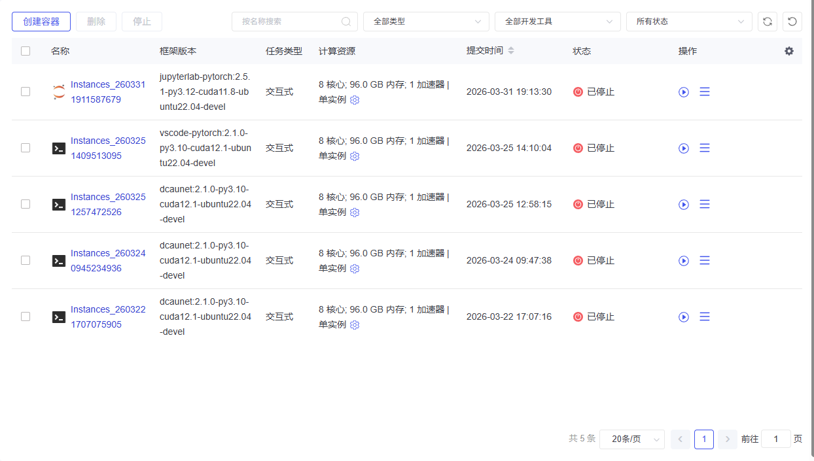

容器实例页面主要包括容器列表展示，对容器实例进行查询和相关操作，主要字段包括：
任务名称：表示创建的容器实例名称且不允许重复；
框架版本：表示使用的镜像名称及版本；
任务模式：包括单实例和多实例任务；
提交时间：任务创建的时间；
规格：任务所占用的资源及持续时间
状态：表示当前任务的状态，有以下 5 种：“等待”表示任务已创建成功，正在等待计算资源，“部署”表示正在部署实例所需的环境，“运行”表示任务正在运行，“停止”表示任务终止，“失败”表示任务执行失败；
操作：表示的是可进行的操作，启动后可以对任务进行停止，启动成功后可以通过 SSH 方式进入容器，固化容器实例。查看日志和删除。
#### 创建容器

<1>点击容器服务进入容器实例管理页面，点击创建容器，支持快速创建和自定义创建，自定义创建，可以选择创建交互式或者任务式。
【快速创建】

【自定义创建】
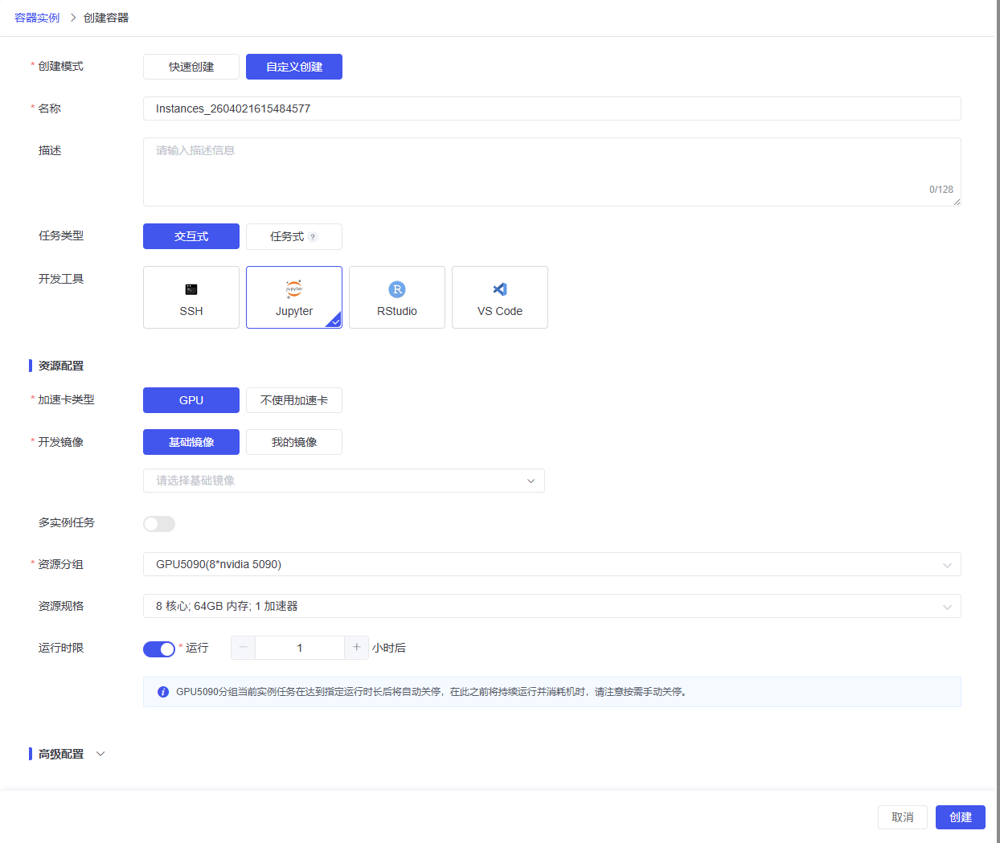

【高级配置】
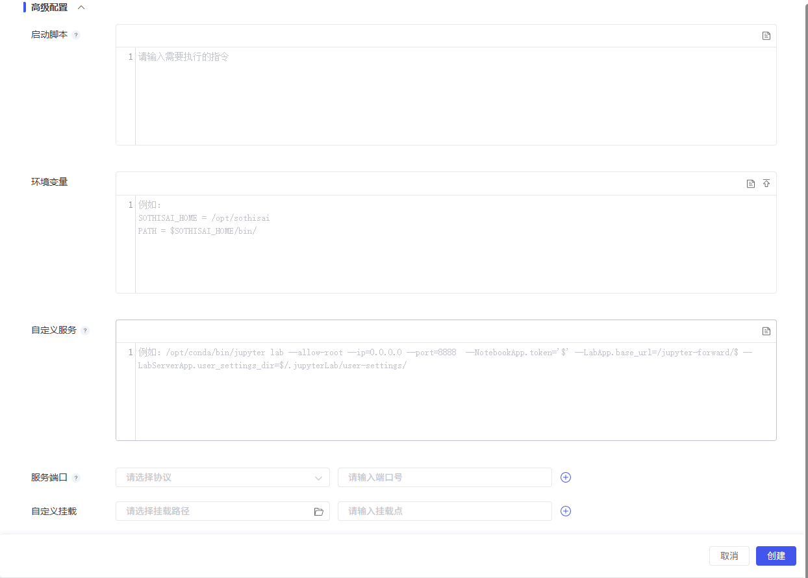

#### SSH访问容器

点击运行状态下实例对应行的“SSH”按钮，开启新的标签页，通过E-Shell访问该实例对应的容器。

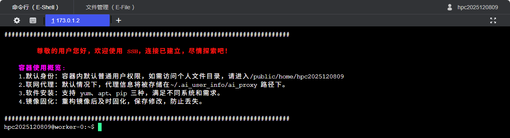

#### 访问 Jupyter 服务

点击运行状态下实例对应行的“Jupyter”按钮，开启新的标签页，访问对应容器的 Jupyter服务。

#### 保存镜像

点击运行状态下实例对应行的“保存镜像”按钮，弹出窗口。
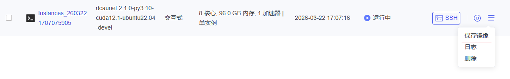

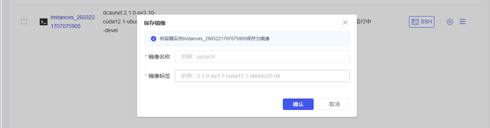

保存镜像页面字段说明：
名称：表示应用的名称；
标签：表示应用的标签；
#### 停止

单个停止：点击容器实例（实例处于等待、部署、运行状态）对应行的“停止”按钮， 弹出确认提示框后，点击“是”按钮，停止此任务。
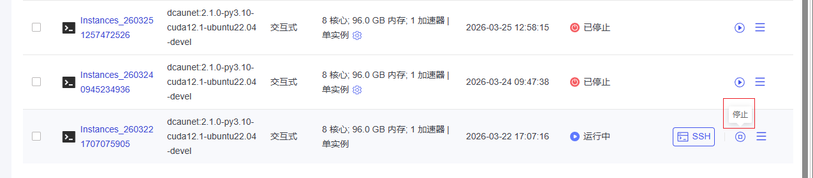

批量停止：点击容器实例对应行的复选框选中多个任务，点击列表上方“停止”按钮， 弹出确认提示框后，点击“是”按钮，停止多个任务。

#### 删除实例

单个删除：点击容器实例对应行的“删除”按钮，弹出确认提示框后，点击“是”按钮， 删除此任务。
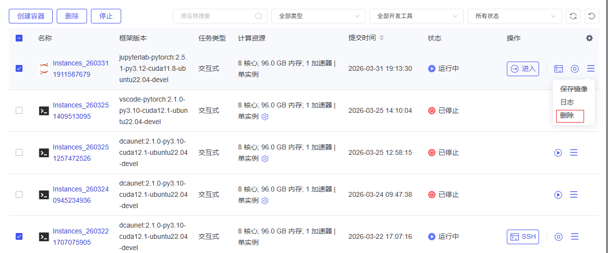

批量删除：点击容器实例对应行的复选框选中多个任务，点击列表上方“删除”按钮， 弹出确认提示框后，点击“是”按钮，删除多个容器实例。
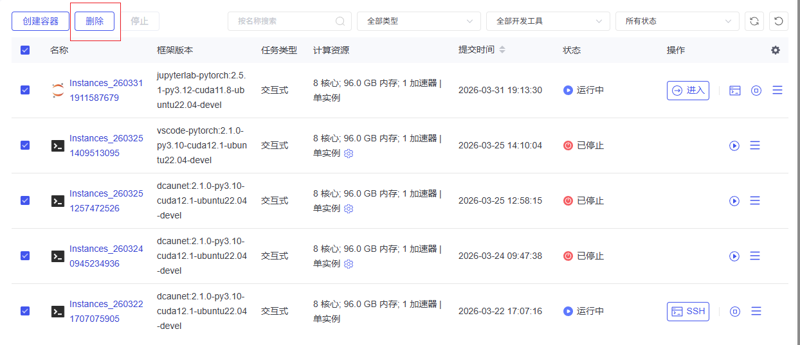

### 我的镜像

点击我的镜像进入页面：
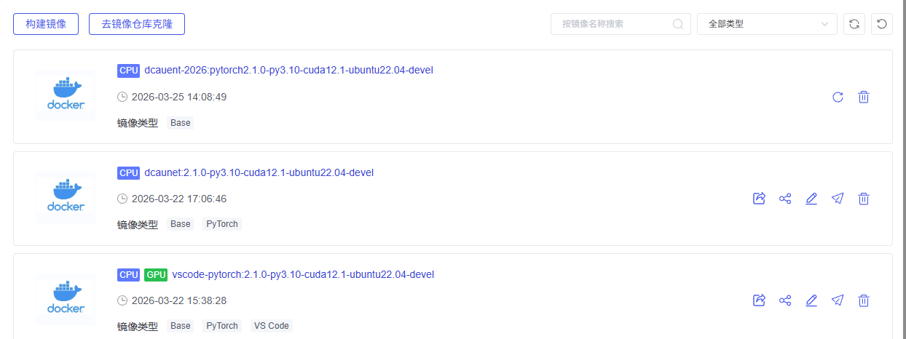

#### 构建镜像

点击页面左上方构建镜像按钮，用户可以自定义制作镜像：
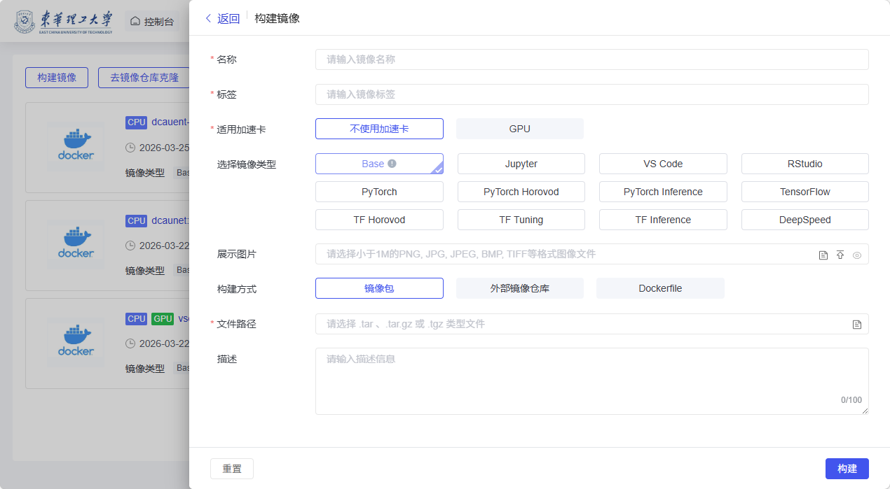

名称：镜像名称
标签：镜像标签
适用加速卡：镜像运行需要的加速器类型
选择镜像类型：镜像的框架类型
展示图片：展示用图片
构建方式：制作镜像的保存格式
文件路径：镜像文件可以通过本地上传或服务器选择镜像文件
描述：镜像描述

操作：
导出
共享
编辑
推送
删除
#### 镜像仓库克隆

点击【镜像仓库】按钮，跳转到镜像仓库页面，可以从镜像库中将已存在的镜像克隆到当前镜像列表。

### 镜像仓库

#### 发布共享

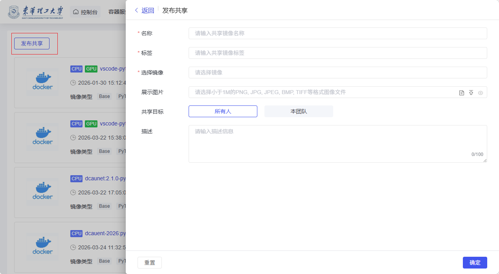

相关选项说明：
共享镜像名称：填写共享镜像名称，名称不允许重复；
共享镜像标签：填写共享镜像标签；
选择镜像：选择镜像信息；
展示图片：共享镜像展示图片，文件格式小于 1M 的 PNG, JPG, JPEG, BMP, TIFF 等格式图像文件，可以通过右边的文件夹浏览按钮选择图片文件，或通过上传按钮上传图片文件，填写完成后可使用预览按钮查看图片；（选填）
共享目标：选择共享目标，可选项为所有人、本团队；
描述：填写镜像共享的描述信息；（选填）
点击右下角确定按钮发布镜像共享，点击左下角重置按钮重新填写信息，添加完成可在共享镜像列表中查看。
#### 克隆

点击列表操作克隆按钮，可克隆共享镜像信息，如图所示：
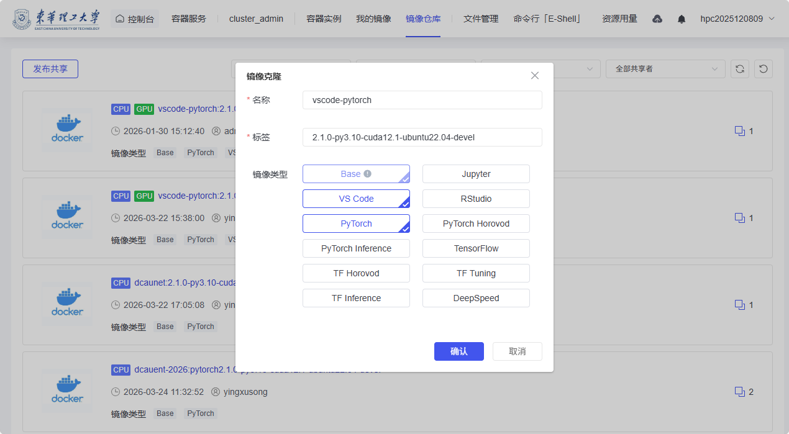

