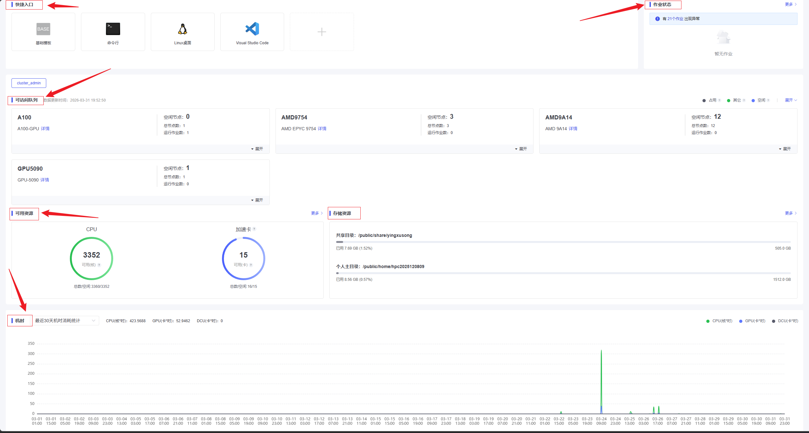

# 概览页介绍

概览页是用户登录平台后的默认工作台，用于集中查看作业、资源、队列和存储状态。

## 概揽页介绍

概揽页是用户登录算力平台后的默认工作界面，主要用于集中展示个人作业状态、平台可访问队列、当前可用资源、存储使用情况以及近期机时统计信息。用户可通过该页面快速了解个人任务运行情况与平台资源概况，并进入后续的作业管理、资源申请、存储管理等功能页面。

### 页面组成

控制台首页主要由以下几个区域构成：
1. 快捷入口区
用于展示平台常用功能的快速访问入口，支持用户一键进入常用操作页面。当前页面中可见的快捷入口包括基础镜像、命令行、Linux 桌面、Visual Studio Code 等，便于用户按不同使用场景快速启动开发或计算环境。
用户可根据实际需要进入对应模块，减少多级菜单跳转，提高日常使用效率。
1. 作业状态区
个人作业全生命周期状态集中看板：
实时展示作业运行、排队、异常等核心状态。
异常作业高亮提醒，点击「更多」可直接跳转作业管理页，查看详情与排查问题。
1. 可访问队列
该区域展示当前用户具备访问权限的资源队列信息，是用户了解平台计算资源分布情况的重要窗口。
每个队列通常展示以下内容：
队列名称或资源类型；
空闲节点数量；
总节点数量；
正在运行的作业数量；
队列详情或展开入口。
1. 可用资源区
该区域主要用于展示用户当前可使用的资源总量与剩余情况，便于用户从整体上把握算力配额。
首页中通常包括以下指标：
CPU 可用资源：展示当前可使用的 CPU 核心数量及总量；
加速卡可用资源：展示当前可用 GPU 或其他加速卡数量及总量。
该区域采用图形化方式展示资源使用情况，能够直观反映平台剩余算力规模。
用户在提交作业前，建议先查看此区域，以避免因资源不足导致排队时间过长或提交失败。
1. 存储资源区
该区域用于展示用户在平台中的存储空间使用情况，通常包括共享目录和个人主目录两部分。
页面中可查看：
目录路径；
已使用容量；
总容量；
当前使用占比。
其中，个人主目录一般用于保存用户个人代码、配置文件与结果数据；共享目录通常用于课题组协作、公共数据交换或项目共享文件存放。
用户应定期关注存储使用率，及时清理不再使用的数据文件，避免因空间不足影响作业运行或结果保存。
1. 机时统计区
该区域用于展示用户在一定时间范围内的资源消耗情况，便于进行机时核算和资源使用分析。
一般可统计以下内容：
CPU 机时；
GPU 卡时；
DCU 卡时（如平台支持）；
不同时间维度下的消耗趋势。
当前页面支持按时间范围查看统计结果，并通过折线图显示近期资源消耗变化。
该功能适用于用户复盘近期任务负载情况，也可为课题组资源规划和后续配额申请提供依据。

