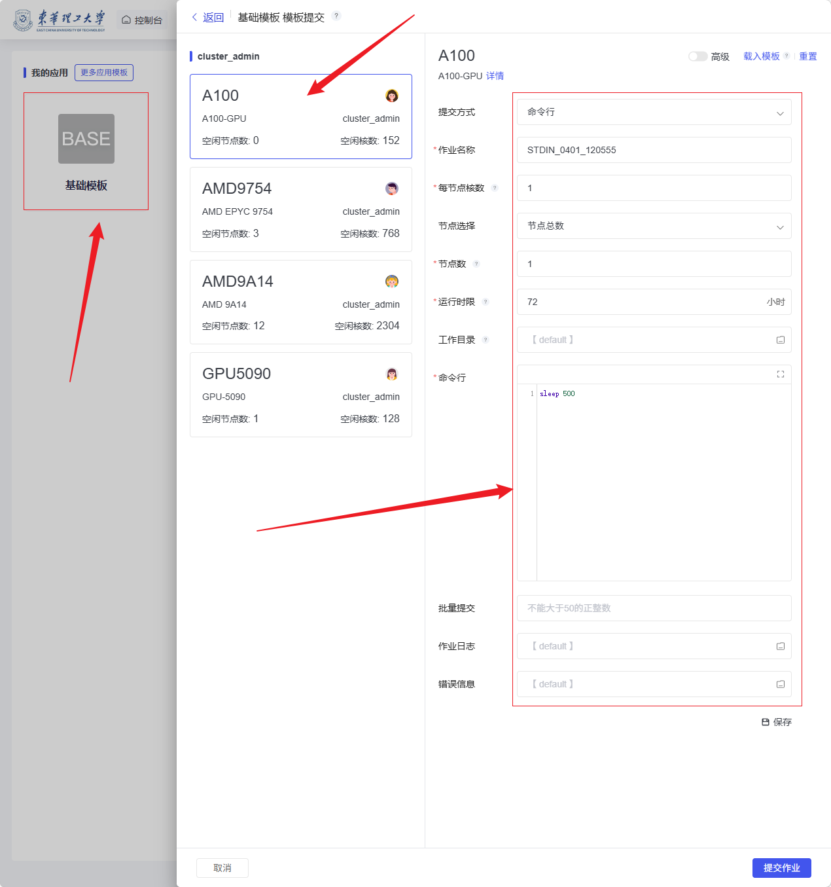

# 工程计算

本页整理图形桌面、仿真计算和作业管理等工程计算场景。

## 工程计算

### 图形桌面

这是工程计算模块中的虚拟桌面功能界面，用于为用户提供基于Linux系统的图形化桌面环境。该功能允许用户创建虚拟桌面实例，进行需要图形界面支持的工程计算、仿真或其他任务。当前页面展示了“Linux桌面”图标，但由于没有创建任何实例，页面为空。
用户可以选择相应的资源配置并启动虚拟桌面。启动后，用户将进入一个完整的图形化工作环境，可以通过鼠标和图形界面进行操作，非常适合进行可视化计算、工程仿真、数据分析等任务。该功能特别适用于需要图形界面的工程计算、软件开发或远程协作等场景。

虚拟桌面实例

### 仿真计算

工程计算模块中的【仿真计算】能用于提交和运行各类工程仿真分析任务，适用于结构计算、数值模拟、参数求解等场景。
用户进入页面后，首先在左侧选择基础模板，在中间区域选择可用计算队列或资源类型，如 A100、AMD9754、AMD9A14、GPU5090 等，然后在右侧填写作业参数，包括提交方式、作业名称、每节点核数、节点数量、运行时限、工作目录及命令行等内容。参数配置完成后，点击页面右下角“提交作业”即可将仿真任务提交到平台调度运行。
该功能为工程类计算任务提供了标准化的资源选择与作业提交流程，便于用户高效完成仿真计算。

### 作业管理

工程计算模块中的【作业管理】功能可参考科学计算。可在该页面管理作业。

