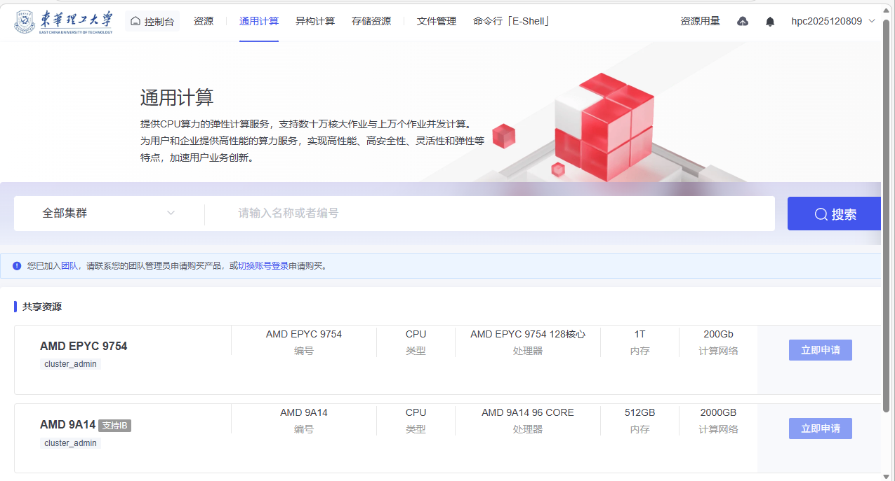
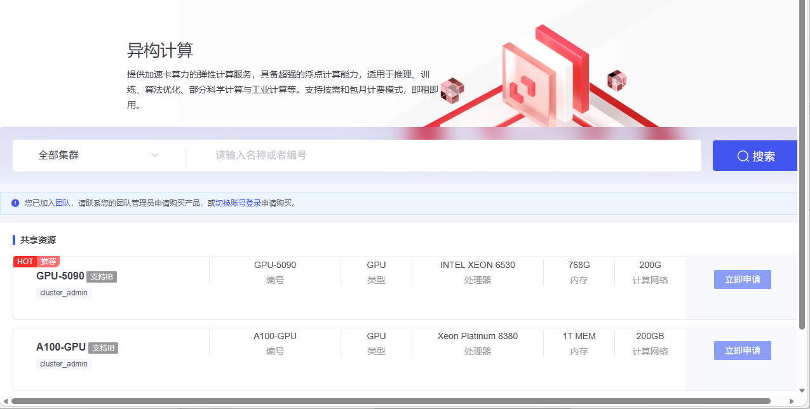

# 资源模块

本页说明通用计算、异构计算和存储资源的申请入口。

## 资源

### 通用计算

资源模块中的通用计算功能，提供了基于 CPU 的计算资源，适用于各种计算需求，包括高性能计算、数据分析、仿真建模等。用户可以根据任务需求选择不同类型的计算资源，如 AMD EPYC 9754 和 AMD 9A14 等型号，选择适合的内存、存储和计算网络配置。通过“立即申请”按钮，用户可以提交资源申请，获得所需计算资源。此功能适用于各类企业和科研人员的计算任务，帮助用户高效利用平台资源，提升计算效率。

### 异构计算

异构计算模块，提供了高性能的GPU计算资源，适用于深度学习、推理训练等需要大规模计算的场景。用户可以选择不同的GPU资源，如GPU-5090和A100-GPU，根据任务需求配置内存和计算资源，进行高效的计算。点击“立即申请”按钮，即可申请所需资源，满足各类科研与工业计算需求。

### 存储计算

存储资源模块，提供不同类型的存储服务，包括SATA和SSD存储，满足从TB到PB级别的存储需求。用户可以根据实际需要选择适合的存储资源，如“public”共享目录，支持加密和访问控制，确保数据的安全性和高效管理。点击“立即申请”按钮，即可申请所需的存储资源，支持多种场景下的数据存储和备份需求。

