# 1   简介

该文档为高性能计算平台用户使用文档，旨在帮助师生快速掌握平台使用方法，高效开展科研计算工作。

---
# 2   快速开始

## **2.1 注册/登录**

**若无账号密码请联系团队管理员获取账号密码。**

## 2.2 文件传输与下载

### 2.2.1 文件传输

在文件管理页面，点击“新建”来创建文件或文件夹，也可以点击“上传”选择自定义目录，然后点击“打开”上传文件，如下图所示：

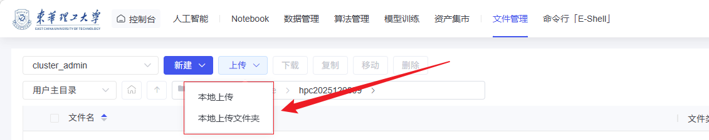
### 2.2.2 文件下载

在文件管理页面，可将选中的文件或文件夹下载到本地，如下图所示：

## 2.3 容器实例

  1  登录后进入控制台，在页面菜单中，点击「容器实例」。

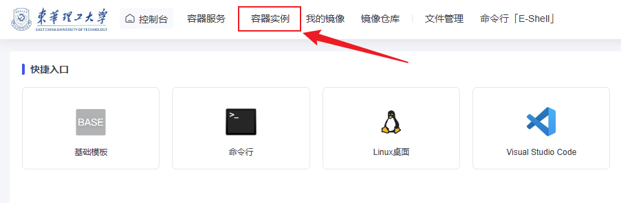

2 在容器实例页面，点击创建容器。

3 在容器创建页面：选择创建模式、名称、GPU 型号、GPU 数量、开发工具、开发镜像，最后创建即可。

## 

4 创建完成后点击启动开机，进入命令行即可开始使用。

## 2.4 命令行

通过命令行在 Web 界面进行快速操作。支持文件管理，配置环境，运行程序等功能。

---
# 3   功能介绍

## 3.1 概揽页介绍

概揽页是用户登录算力平台后的默认工作界面，主要用于集中展示个人作业状态、平台可访问队列、当前可用资源、存储使用情况以及近期机时统计信息。用户可通过该页面快速了解个人任务运行情况与平台资源概况，并进入后续的作业管理、资源申请、存储管理等功能页面。

### 3.1.1页面组成

控制台首页主要由以下几个区域构成：

#### **1.快捷入口区**

用于展示平台常用功能的快速访问入口，支持用户一键进入常用操作页面。当前页面中可见的快捷入口包括基础镜像、命令行、Linux 桌面、Visual Studio Code 等，便于用户按不同使用场景快速启动开发或计算环境。

 用户可根据实际需要进入对应模块，减少多级菜单跳转，提高日常使用效率。

#### **2.作业状态区**

个人作业全生命周期状态集中看板：

* 实时展示作业运行、排队、异常等核心状态。

* 异常作业高亮提醒，点击「更多」可直接跳转作业管理页，查看详情与排查问题。

#### **3.可访问队列**

该区域展示当前用户具备访问权限的资源队列信息，是用户了解平台计算资源分布情况的重要窗口。

每个队列通常展示以下内容：

* 队列名称或资源类型； 

*  空闲节点数量； 

*  总节点数量； 

*  正在运行的作业数量； 

*  队列详情或展开入口。

#### **4.可用资源区**

该区域主要用于展示用户当前可使用的资源总量与剩余情况，便于用户从整体上把握算力配额。

首页中通常包括以下指标：

* **CPU 可用资源**：展示当前可使用的 CPU 核心数量及总量； 

* **加速卡可用资源**：展示当前可用 GPU 或其他加速卡数量及总量。 

该区域采用图形化方式展示资源使用情况，能够直观反映平台剩余算力规模。

用户在提交作业前，建议先查看此区域，以避免因资源不足导致排队时间过长或提交失败。

#### **5.存储资源区**

该区域用于展示用户在平台中的存储空间使用情况，通常包括共享目录和个人主目录两部分。

页面中可查看：

*  目录路径； 

*  已使用容量； 

*  总容量； 

*  当前使用占比。 

其中，**个人主目录**一般用于保存用户个人代码、配置文件与结果数据；**共享目录**通常用于课题组协作、公共数据交换或项目共享文件存放。

用户应定期关注存储使用率，及时清理不再使用的数据文件，避免因空间不足影响作业运行或结果保存。

#### **6.机时统计区**

该区域用于展示用户在一定时间范围内的资源消耗情况，便于进行机时核算和资源使用分析。

 一般可统计以下内容：

*  CPU 机时； 

*  GPU 卡时； 

*  DCU 卡时（如平台支持）； 

*  不同时间维度下的消耗趋势。 

当前页面支持按时间范围查看统计结果，并通过折线图显示近期资源消耗变化。

该功能适用于用户复盘近期任务负载情况，也可为课题组资源规划和后续配额申请提供依据。

## 3.2 导航栏介绍

导航栏将平台分成了两大部分：服务和产品。

### 3.2.1 服务

包括科学计算、工程计算、人工智能和容器服务等模块。

### 3.2.2 产品

包括通用计算、异构计算、存储资源。

同时右上角提供资源用量查看、消息通知和个人账户入口，方便用户进行资源监控、消息处理与账户管理。

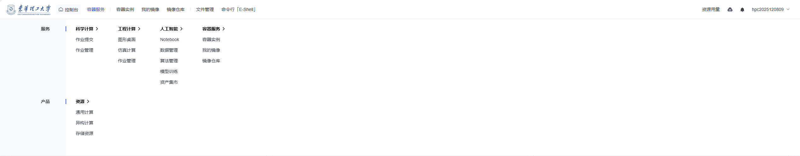

---
## 3.3 科学计算

科学计算模块提供了一系列强大的计算功能，旨在为用户的科研工作提供高效的计算资源和工具支持。通过该模块，用户可以提交批量计算作业、进行数据分析、执行仿真任务等。平台提供了多种计算资源选项，包括 CPU 和 GPU 计算队列，用户可以根据任务需求选择合适的资源类型。在使用过程中，用户能够实时查看作业状态，监控计算资源的使用情况，并进行相应的调度和优化。本节将详细介绍科学计算模块的各项功能，帮助用户快速上手并高效利用平台的计算能力。

#### 3.3.1 作业提交

* 科学计算模块中的[【作业提交】](http://172.18.127.188:6080/ac/console6/index.html#/job-submit)功能用于创建和提交批处理计算任务。

* 用户进入该页面后，点击左侧选择所需的基础模板，在中间区域选择可用计算队列或资源类型，再在右侧填写作业相关参数，包括提交方式、作业名称、单节点核数、节点数量、运行时限、工作目录及执行命令等信息。参数填写完成并确认无误后，点击页面下方“提交作业”按钮即可完成任务提交。

* 该功能适用于程序编译、脚本执行、批量计算等科学计算场景，是用户开展作业运行与资源调度的主要入口。

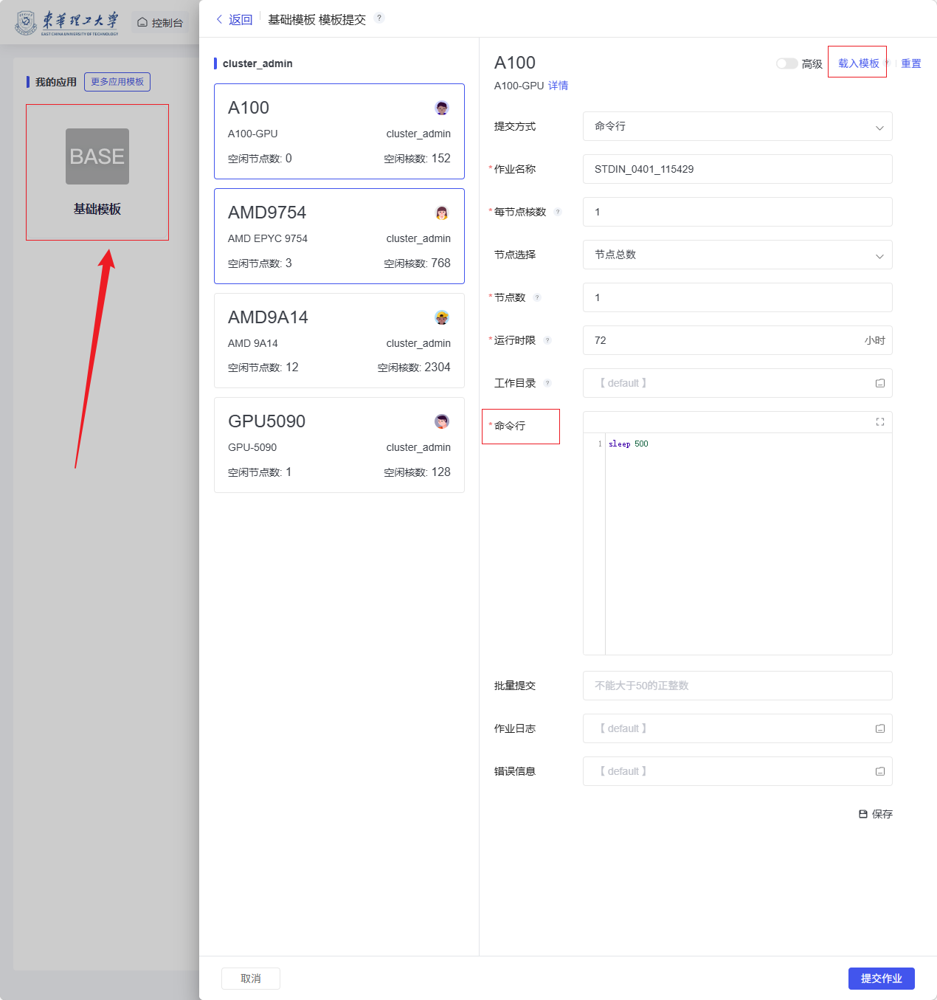
#### 3.3.2 作业管理

科学计算模块中的[【作业管理】](http://172.18.127.188:6080/ac/console6/index.html#/job-list/current)主要包括：

* SSH

* 容器详情

* 作业日志

* 错误信息

* 工作目录

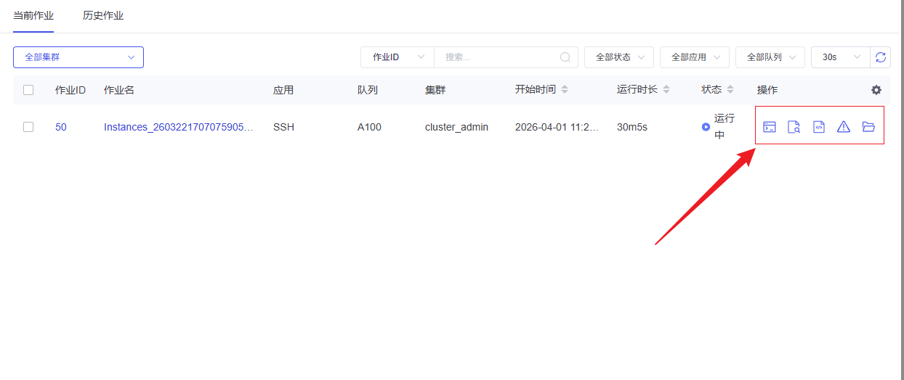
## 3.4 工程计算

#### 3.4.1 图形桌面

* 这是工程计算模块中的虚拟桌面功能界面，用于为用户提供基于Linux系统的图形化桌面环境。该功能允许用户创建虚拟桌面实例，进行需要图形界面支持的工程计算、仿真或其他任务。当前页面展示了“Linux桌面”图标，但由于没有创建任何实例，页面为空。

* 用户可以选择相应的资源配置并启动虚拟桌面。启动后，用户将进入一个完整的图形化工作环境，可以通过鼠标和图形界面进行操作，非常适合进行可视化计算、工程仿真、数据分析等任务。该功能特别适用于需要图形界面的工程计算、软件开发或远程协作等场景。

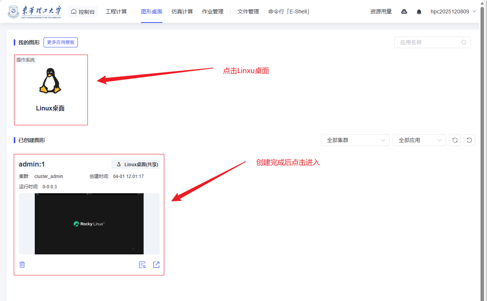
* 虚拟桌面实例

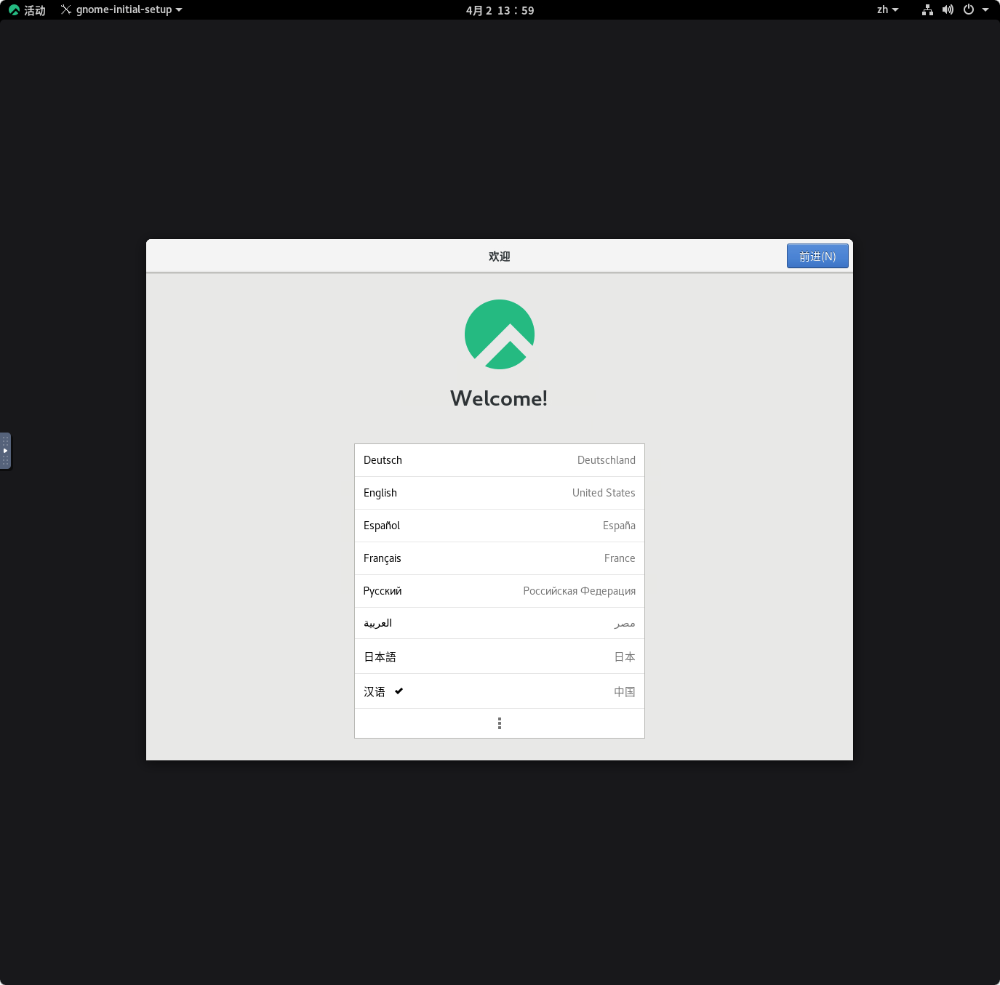
#### 3.4.2 仿真计算

* 工程计算模块中的[【仿真计算】](http://172.18.127.188:6080/ac/console6/index.html#/emulation)能用于提交和运行各类工程仿真分析任务，适用于结构计算、数值模拟、参数求解等场景。

* 用户进入页面后，首先在左侧选择基础模板，在中间区域选择可用计算队列或资源类型，如 A100、AMD9754、AMD9A14、GPU5090 等，然后在右侧填写作业参数，包括提交方式、作业名称、每节点核数、节点数量、运行时限、工作目录及命令行等内容。参数配置完成后，点击页面右下角“提交作业”即可将仿真任务提交到平台调度运行。

* 该功能为工程类计算任务提供了标准化的资源选择与作业提交流程，便于用户高效完成仿真计算。

#### 3.4.3 作业管理

工程计算模块中的[【作业管理】](http://172.18.127.188:6080/ac/console6/index.html#/engineering-job-list/current)功能可参考科学计算。可在该页面管理作业。

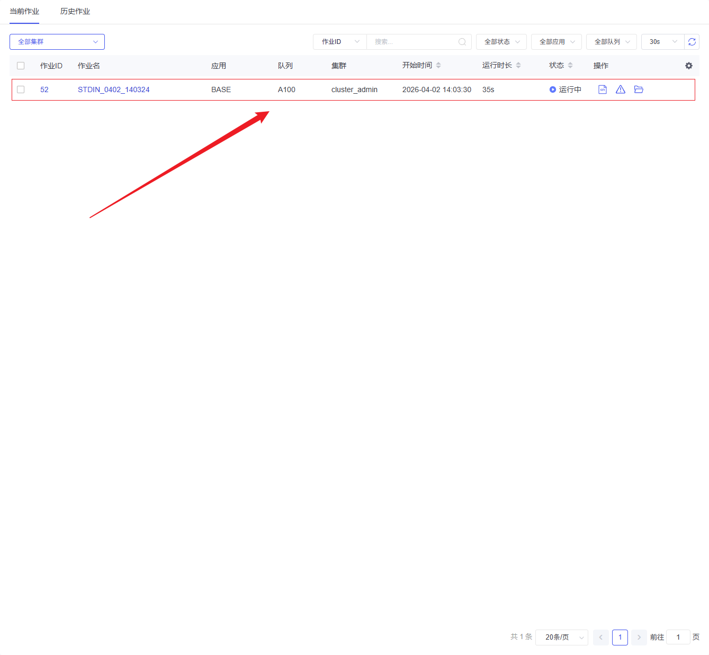
## 3.5 人工智能

### 3.5.1 Notebook

* 人工智能模块中的 [【Notebook】](http://172.18.127.188:6080/ac/console6/index.html#/notebook)功能主要用于为用户提供一个开箱即用的在线开发与实验环境，适合开展数据处理、模型训练、算法调试和结果分析等人工智能相关工作。

* 用户进入页面后，点击“创建 Notebook”，填写实例名称，并根据实际需求选择相应的框架版本（如 PyTorch、TensorFlow、DeepSpeed）和资源规格（如 CPU、内存、加速器等），也可通过“自定义创建”进一步配置运行环境；参数确认无误后，点击“创建”即可启动 Notebook 实例。

* 创建完成后，用户可直接进入在线交互式开发界面，在浏览器中编写和运行代码，无需单独安装本地环境。

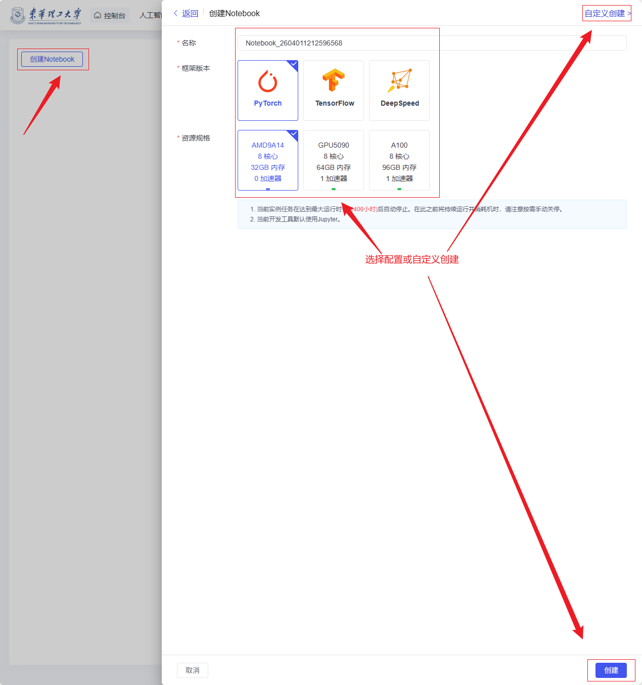
Notebook 页面主要功能为创建 Notebook 任务，展示已创建的 Notebook 任务列表，包含列表的查询功能，列表主要展示 Notebook 信息包括： 

* **实例名：**表示创建的 Notebook 任务名称且不允许重复； 

* **镜像版本：**表示使用的镜像名称及版本； 

* **创建时间：**任务创建的时间； 

* **规格：**任务所占用的资源及持续时间 

* **状态：**表示当前任务的状态，有以下 5 种：“等待”表示任务已创建成功，正在等待计 算资源，“部署”表示正在部署实例所需的环境，“运行”表示任务正在运行，“停止”表示任务终止，“失败”表示任务执行失败； 

* **操作：**表示的是可进行的操作，可以进行 Notebook 任务启动，启动后可以对任务进行 停止，启动成功后可以进入 Notebook 界面，另外可以删除 Notebook 任务。

### 3.5.2 数据管理

#### 3.5.2.1 我的数据

在此界面，用户可以查看和管理已上传的数据集。点击“**添加数据集**”可上传新数据集，方便数据的后续使用和管理。

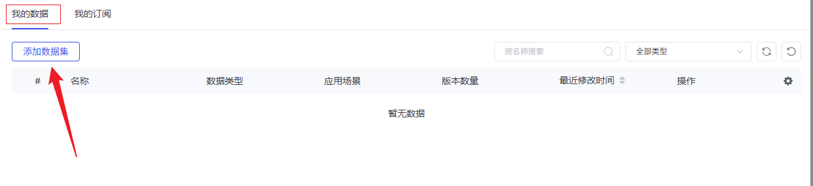
#### 3.5.2.2 我的订阅

该界面显示用户订阅的数据集，点击“**订阅更多数据**”可浏览和订阅其他数据集，扩展数据资源。

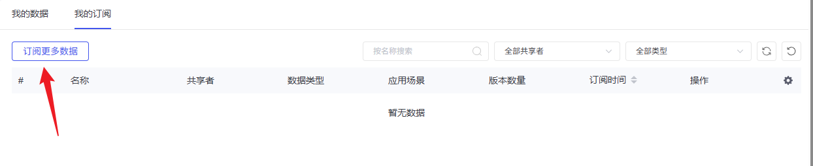
### 3.5.3 算法管理

* **算法管理功能**，用于管理和共享用户的计算代码。用户可以通过“**添加共享**”按钮上传并共享自己的算法代码。

* 上传时，用户需填写代码名称、选择共享对象（如个人或团队）以及相关描述信息。完成后，点击“**添加**”按钮将算法共享给指定对象，其他团队成员可以通过此功能访问并使用共享的算法资源。

* 此功能有助于团队间的协作，提高计算资源的共享和利用效率。

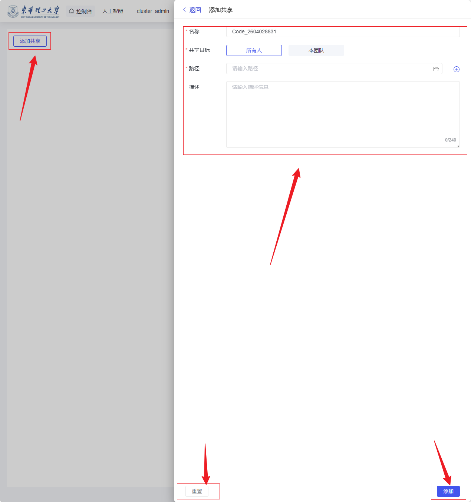
### 3.5.4 模型训练

#### 3.5.4.1 训练

进入人工智能模块的模型训练功能，点击“模型训练”——>“创建训练”——>“Tensorflow/Pytorch”。

**配置调参**

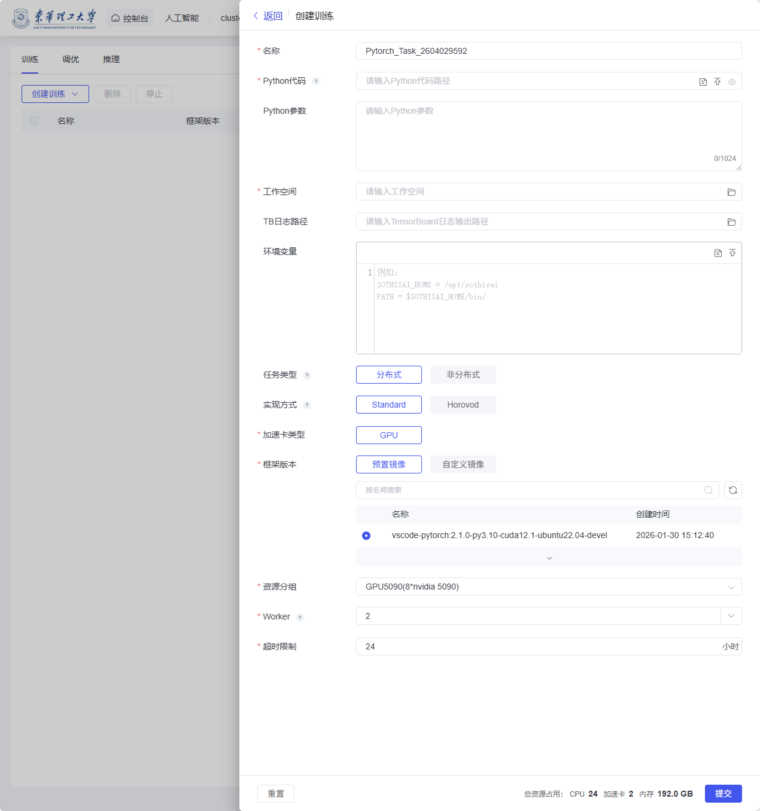
**相关选项说明：**

* “任务名”可以进行自定义，但不能重复；

* “Python 代码”可以根据提示加载已有文件，或者上传本地文件；

* “Python 参数”可以自定义输入对应参数；

* “工作空间”可以通过自定义选择工作路径，一般填入 Python 参数会自动生成；

* “TB 日志路径”也可自定义，可不填；

* “环境变量”根据需要填写即可；

* “任务类型”分为分布式和非分布式，根据需要选择即可；

* “加速器类型”会根据实际的申请资源显示；

* “框架版本”点击后面的箭头选择需要的即可；

* “资源分组”为实际申请的 dcu 队列名；

* “Parameter Server”可以调整 CPU 数量和内存大小，申请时默认 CPU 数     量2核，内存16G；

* “Worker”可以调整 CPU 数量、DCU 数量、内存大小，申请时默认 CPU 数量1核，DCU 数量1卡，内存16G；

*  超时限制默认为 24h。 注：资源占用会显示最终的总 CPU 核数和 DCU 卡数以及内存占用总数。

* 点击提交，创建训练后，需要等待“状态”属性变成完成说明运行完成。

#### 3.5.4.2 调优

##### 3.5.4.2.1 调优管理页面

* 点击“调优”标签页按钮，访问调优任务管理页面。

* TensorFlow深度学习调优任务主页面显示已经创建过的TensorFlow 深度学习调优任务，分为“名称”、“框架版本”、“状态”、“提交时间”、“持续时间”和“操作”六列：

* **名称：**表示创建的 TensorFlow 调优任务名称且不允许重复；

* **镜像版本：**表示使用的 TensorFlow 镜像版本；

* **状态：**表示当前任务的状态，有以下 6 种：“等待”表示训练任务已创建成功，正在等待计算资源，“部署”表示正在部署执行训练的环境，“运行”表示训练任务正在运行，“停止”表示训练任务终止，“完成”表示训练任务已经完成，“失败”表示训练任务执行失败；

* **提交时间：**表示 TensorFlow 调优任务的创建时间；

* **持续时间：**表示 TensorFlow 调优任务的运行时长；

* **操作：**表示的是可进行的操作，可以进行 “克隆”、“日志”、“原因”、“停止”和“删除”。

##### 3.5.4.2.2 创建任务

点击“**创建调优任务**”进入 TensorFlow 调优任务创建页面，调优任务以分布式的方式执行，Master 负责发布、统计迭代次数和数据记录，Worker 用于具体执行调优任务。

#### 3.5.4.3 推理

[【推理】](http://172.18.127.188:6080/ac/console6/index.html#/model-training/inference)功能页面

创建推理任务页面

### 3.5.5 资产集市

[【资产集市】](http://172.18.127.188:6080/ac/console6/index.html#/sharing-center/data)提供给用户数据集共享功能，用户在数据中点击“添加分享”，可以把自己的数据集放到资产集市中供其他用户下载，使用。

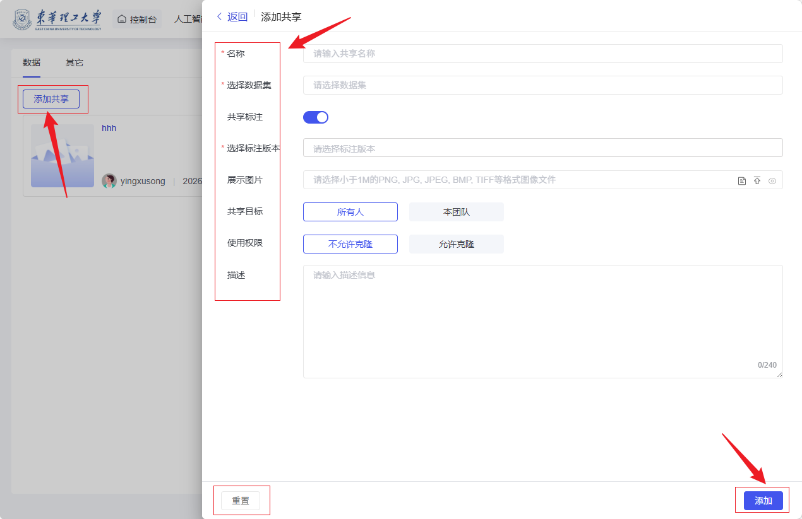
可看到其他用户共享的数据集，订阅后即可使用，订阅后的数据集在“数据”，“我的订阅”中查看。

## 3.6 容器服务

什么是容器实例？

* 容器实例是一个轻量级、可执行的独立软件包，其中包含了运行特定应用程序所需的一切：包括代码、运行时环境、库、系统工具、配置文件等。它提供了一种虚拟化方式，通过对操作系统的隔离，确保应用程序在任何环境中都能一致运行。容器实例的最大特点是它们独立、快速、便捷且易于迁移。

* 容器实例通过容器引擎（如Docker）进行管理和运行，能够在任何支持容器的环境中部署，无论是在开发、测试还是生产环境中。它提供了一种简化的软件部署方式，解决了“在我机器上能运行”的问题，确保应用程序在不同机器和平台之间的兼容性和一致性。

### 3.6.1 容器实例

点击容器服务进入容器实例管理页面，页面展示用户建的所有容器列表：

容器实例页面主要包括容器列表展示，对容器实例进行查询和相关操作，主要字段包括：

* **任务名称：** 表示创建的容器实例名称且不允许重复；

* **框架版本：** 表示使用的镜像名称及版本；

* **任务模式：** 包括单实例和多实例任务；

* **提交时间：** 任务创建的时间；

* **规格：** 任务所占用的资源及持续时间

* **状态：** 表示当前任务的状态，有以下 5 种：“等待”表示任务已创建成功，正在等待计算资源，“部署”表示正在部署实例所需的环境，“运行”表示任务正在运行，“停止”表示任务终止，“失败”表示任务执行失败；

* **操作：** 表示的是可进行的操作，启动后可以对任务进行停止，启动成功后可以通过 SSH 方式进入容器，固化容器实例。查看日志和删除。

#### 3.6.1.1 创建容器

<1>点击容器服务进入容器实例管理页面，点击创建容器，支持快速创建和自定义创建，自定义创建，可以选择创建交互式或者任务式。

【快速创建】

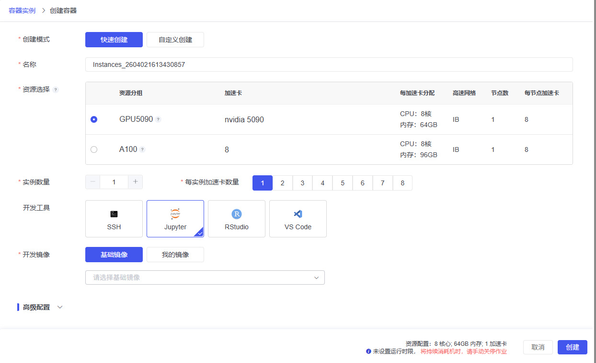
【自定义创建】

【高级配置】

#### 3.6.1.2 SSH访问容器

点击运行状态下实例对应行的“SSH”按钮，开启新的标签页，通过E-Shell访问该实例对应的容器。

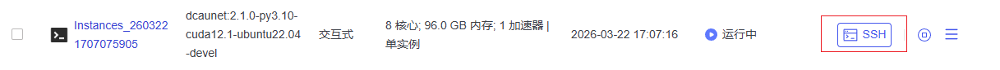

#### 3.6.1.3 访问 Jupyter 服务

点击运行状态下实例对应行的“Jupyter”按钮，开启新的标签页，访问对应容器的 Jupyter服务。

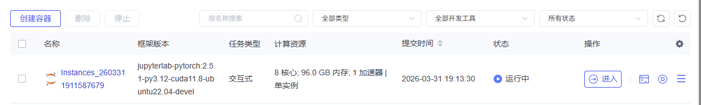
#### 3.6.1.4 保存镜像

点击运行状态下实例对应行的“保存镜像”按钮，弹出窗口。

保存镜像页面字段说明： 

名称：表示应用的名称； 

标签：表示应用的标签；

#### 3.6.1.5 停止

**单个停止：**点击容器实例（实例处于等待、部署、运行状态）对应行的“停止”按钮， 弹出确认提示框后，点击“是”按钮，停止此任务。

**批量停止：**点击容器实例对应行的复选框选中多个任务，点击列表上方“停止”按钮， 弹出确认提示框后，点击“是”按钮，停止多个任务。

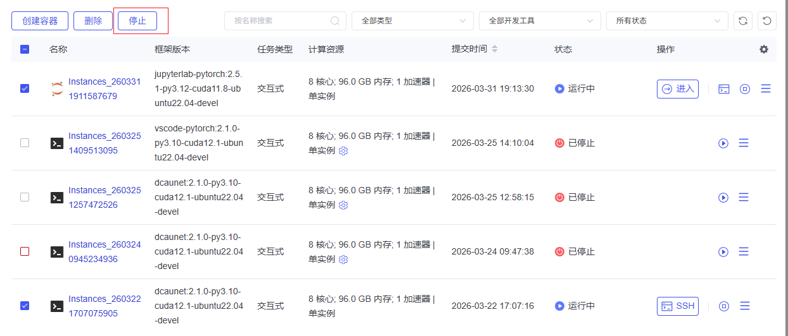
#### 3.6.1.6 删除实例

**单个删除：**点击容器实例对应行的“删除”按钮，弹出确认提示框后，点击“是”按钮， 删除此任务。 

**批量删除：**点击容器实例对应行的复选框选中多个任务，点击列表上方“删除”按钮， 弹出确认提示框后，点击“是”按钮，删除多个容器实例。

### 3.6.2 我的镜像

点击我的镜像进入页面：

#### **3.6.2.1 构建镜像**

点击页面左上方构建镜像按钮，用户可以自定义制作镜像：

构建镜像说明： 

**名称**：镜像名称 

**标签**：镜像标签 

**适用加速卡**：镜像运行需要的加速器类型 

**选择镜像类型**：镜像的框架类型 

**展示图片**：展示用图片 

**构建方式**：制作镜像的保存格式 

**文件路径**：镜像文件可以通过本地上传或服务器选择镜像文件

**描述**：镜像描述

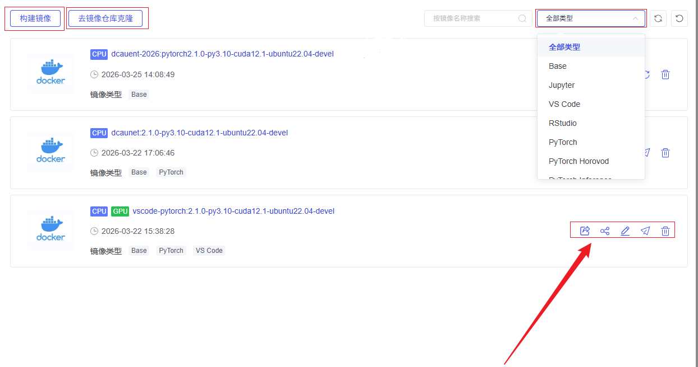
操作：

* 导出

* 共享

* 编辑

* 推送

* 删除

#### 3.6.2.2 镜像仓库克隆

点击【镜像仓库】按钮，跳转到镜像仓库页面，可以从镜像库中将已存在的镜像克隆到当前镜像列表。

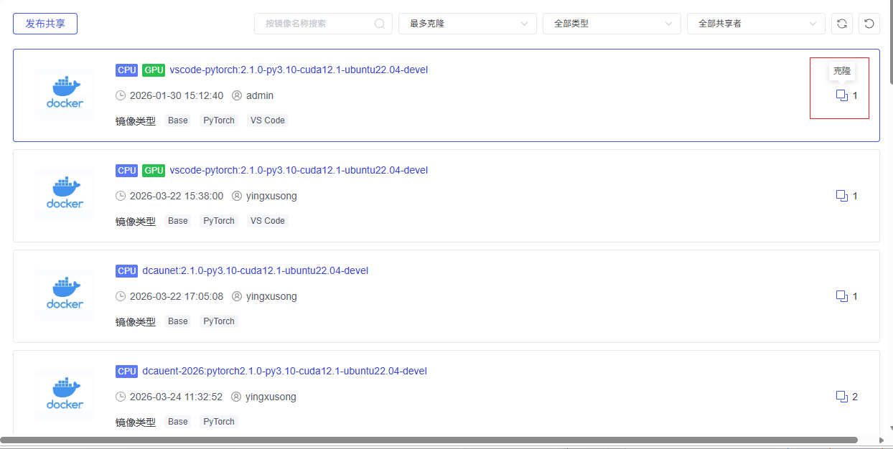
### 3.6.3 镜像仓库

#### 3.6.3.1 发布共享

**相关选项说明：**

* 共享镜像名称：填写共享镜像名称，名称不允许重复；

* 共享镜像标签：填写共享镜像标签；

* 选择镜像：选择镜像信息；

* 展示图片：共享镜像展示图片，文件格式小于 1M 的 PNG, JPG, JPEG, BMP, TIFF 等格式图像文件，可以通过右边的文件夹浏览按钮选择图片文件，或通过上传按钮上传图片文件，填写完成后可使用预览按钮查看图片；（选填）

* 共享目标：选择共享目标，可选项为所有人、本团队；

* 描述：填写镜像共享的描述信息；（选填）

* 点击右下角确定按钮发布镜像共享，点击左下角重置按钮重新填写信息，添加完成可在共享镜像列表中查看。

#### 3.6.3.2 克隆

点击列表操作克隆按钮，可克隆共享镜像信息，如图所示：

## 3.7 资源

### 3.7.1 通用计算

**资源模块中的通用计算功能**，提供了基于 CPU 的计算资源，适用于各种计算需求，包括高性能计算、数据分析、仿真建模等。用户可以根据任务需求选择不同类型的计算资源，如 AMD EPYC 9754 和 AMD 9A14 等型号，选择适合的内存、存储和计算网络配置。通过“立即申请”按钮，用户可以提交资源申请，获得所需计算资源。此功能适用于各类企业和科研人员的计算任务，帮助用户高效利用平台资源，提升计算效率。

### 3.7.2 异构计算

**异构计算**模块，提供了高性能的GPU计算资源，适用于深度学习、推理训练等需要大规模计算的场景。用户可以选择不同的GPU资源，如GPU-5090和A100-GPU，根据任务需求配置内存和计算资源，进行高效的计算。点击“立即申请”按钮，即可申请所需资源，满足各类科研与工业计算需求。

### 3.7.3 存储计算

**存储资源**模块，提供不同类型的存储服务，包括SATA和SSD存储，满足从TB到PB级别的存储需求。用户可以根据实际需要选择适合的存储资源，如“public”共享目录，支持加密和访问控制，确保数据的安全性和高效管理。点击“立即申请”按钮，即可申请所需的存储资源，支持多种场景下的数据存储和备份需求。

# 3.8 个人中心

**个人中心**界面，用户可以在此管理自己的账户信息、查看已加入的团队、资源申请、作业状态等。通过此界面，用户可以快速访问“我的资源”、“我的团队”、“我的申请”等模块，便于管理个人的计算资源、团队成员以及提交的资源申请。用户还可以查看和编辑个人资料，确保账户信息的更新和准确。

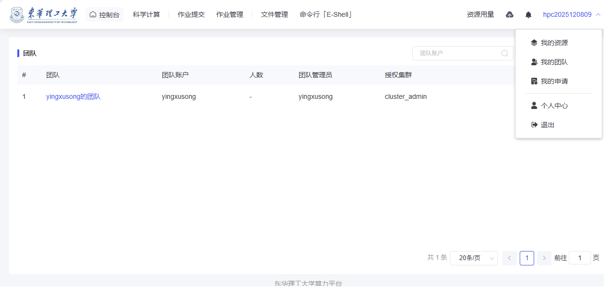

---
# 4   常见问题

## 4.1 命令行常见命令

|**命令**|**功能**|**示例**|
|:----|:----|:----|
|ls|列出当前目录下的文件和文件夹|ls|
|cd|切换目录|cd /path/to/directory|
|pwd|显示当前工作目录的完整路径|pwd|
|mkdir|创建新目录|mkdir new_directory|
|rm|删除文件或目录|rm filenamerm -r directory_name|
|cp|复制文件或目录|cp source_file destinationcp -r source_directory destination_directory|
|mv|移动或重命名文件|mv old_name new_namemv source_file destination|
|cat|显示文件内容|cat filename|
|top|查看系统资源使用情况|top|
|ps|查看当前运行的进程|ps aux|
|kill|终止进程|kill PID|
|grep|搜索文件内容|grep 'pattern' filename|
|chmod|改变文件或目录的权限|chmod 755 filename|
|nano / vi|编辑文件|nano filenamevi filename|
|df|查看磁盘空间使用情况|df -h|
|du|查看目录或文件的磁盘使用量|du -sh directory_name|

## 4.2 账号问题

### 4.2.1 第一种情况

**进来的是登陆节点**

**这个时候，进来的是登陆节点，显示的ip是10.10.10.253**

如果不使用容器实例，比如科学计算，用cpu那种，注意要切换到计算节点，命令是ssh admin。这样就到了计算节点。

### 4.2.2 第二种情况

如果是使用docker，要在容器实例里面执行，这里点ssh就到了容器实例里面。

注意此时的网址和账号

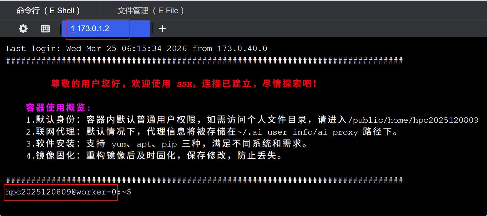
也可以使用命令 ssh 173.0.1.2

### 4.2.3 权限问题

进来之后，如果想安装python依赖，可能会权限不够，要将docker里面账号的权限提升到root，命令是sudo -s

